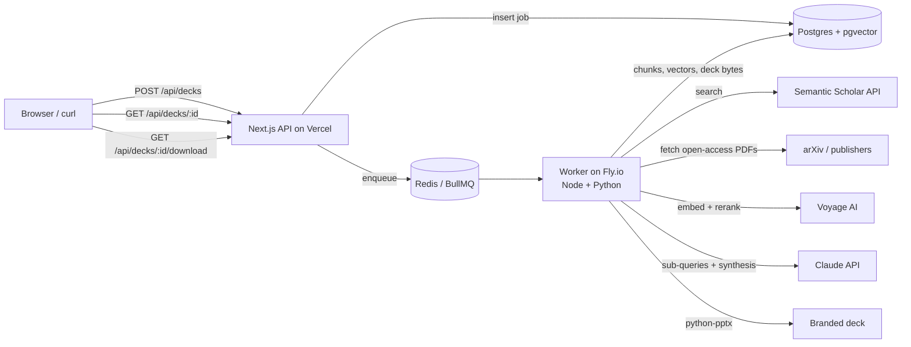

# Research-to-Deck Generator

POST a research topic → get back a branded PowerPoint deck built from 50+ papers, where every bullet cites its source paper. This is the core pipeline behind deep-research.intelliforge.tech.

**Business impact:** about 3 days of literature review becomes about 5 minutes.

## Architecture



| Stage | What happens |
|---|---|
| **Searching** | Semantic Scholar paper search (relevance-ranked, over-fetched 2×). Papers with a PDF or abstract rank ahead of title-only ones. Results are cached for 24h per topic. |
| **Ingesting** | Open-access PDFs are downloaded 6 at a time (max 20 MB, 30 pages) and their text extracted with `unpdf`. The references section is dropped. Text is split into ~800-token chunks with ~100 tokens of overlap, and each chunk keeps the page it starts on. **Every paper also gets a title+abstract chunk, so papers without a PDF fall back to their abstract instead of being dropped.** Chunks are embedded with `voyage-3.5` (1024 dims) and stored in pgvector. Papers already ingested are reused across jobs. |
| **Retrieving** | Claude writes 5 sub-queries that cover different angles of the topic. For the topic plus each sub-query, the worker takes the top 15 chunks by exact cosine search over this job's papers. The pooled results are deduped and re-ranked with Voyage `rerank-2.5`, and no paper contributes more than 3 of the final 30 chunks. |
| **Synthesizing** | Claude (`claude-sonnet-5`, structured JSON output) writes 8–12 slides with 3–5 bullets each, speaker notes, and citation keys for every bullet. The worker checks every citation key against the retrieved set: unknown keys are removed and bullets left without a citation are dropped. If any rule is broken, Claude gets one repair pass with the list of problems. |
| **Rendering** | `python/render_deck.py` (python-pptx) builds a 16:9 deck from `python/brand.json`: a title slide, content slides with `[n]` citation markers, speaker notes on every slide, and numbered reference slides that list only the papers actually cited. |

The finished `.pptx` is stored in the `jobs` table and served by `GET /api/decks/:id/download`, so no separate blob store is needed.

### Why the worker is not on Vercel

Vercel functions can't host a long-running BullMQ consumer or run Python inside a Node function, and a 50-paper job runs for minutes. So the Next.js app (form + API) deploys to Vercel, and the worker deploys as a container (`Dockerfile.worker`) on Fly.io (Railway or Render work the same way). Both connect to the same Postgres and Redis.

## Local setup

Prerequisites: Node 22+, Python 3.10+ with `python-pptx`, and Docker.

```bash
npm install
pip install python-pptx==1.0.2
docker compose up -d                 # pgvector on :5433, Redis on :6380
cp .env.example .env.local           # then fill in the keys
npm run db:migrate
npm run dev                          # terminal 1: http://localhost:3000
npm run worker                       # terminal 2: BullMQ worker
```

### Environment variables

| Variable | Used by | Notes |
|---|---|---|
| `ANTHROPIC_API_KEY` | worker | Claude sub-queries + synthesis |
| `CLAUDE_MODEL` | worker | optional, default `claude-sonnet-5` |
| `VOYAGE_API_KEY` | worker | embeddings + reranking |
| `SEMANTIC_SCHOLAR_API_KEY` | worker | **required in practice.** The keyless shared pool now answers 429 to every request, so jobs stall in backoff and fail at the `searching` stage. Request a key at [semanticscholar.org/product/api](https://www.semanticscholar.org/product/api). |
| `DATABASE_URL` | app + worker | Postgres with the `vector` extension (Neon or Supabase in prod) |
| `REDIS_URL` | app + worker | `rediss://` for TLS (e.g. Upstash) |
| `PYTHON_BIN` | worker | interpreter with python-pptx (`python3` in the Docker image) |

## API

```bash
# create a job
curl -X POST http://localhost:3000/api/decks \
  -H "Content-Type: application/json" \
  -d '{"topic":"retrieval-augmented generation evaluation","paperCount":50}'
# -> 202 {"jobId":"…","statusUrl":"…/api/decks/…"}

# poll status
curl http://localhost:3000/api/decks/<jobId>
# -> {"status":"running","stage":"ingesting","progress":34,"stats":{…},"downloadUrl":null}

# download when status is "done"
curl -o deck.pptx http://localhost:3000/api/decks/<jobId>/download
```

`paperCount` is 10–100 (default 50). Stages: `queued → searching → ingesting → retrieving → synthesizing → rendering → done | failed`.

Run the whole flow end to end and save the deck to `smoke-deck.pptx`:

```bash
npm run smoke -- http://localhost:3000 "retrieval-augmented generation evaluation" 50
```

## Deploy

Live: **https://research-to-deck.vercel.app** (app on Vercel, worker on Fly.io).

1. **Database:** on the Vercel project, Storage → Create Database → Neon (free tier), connected to the project. That sets `DATABASE_URL`. Copy the value into `.env.local` and run `npm run db:migrate`.
2. **Redis:** Storage → Create Database → Upstash → **Redis** (not QStash or Vector), connected to the project. That sets `REDIS_URL`. Copy the `rediss://` value into `.env.local` too.
3. **Worker:** `fly apps create research-to-deck-worker`, then stage the secrets and deploy the container from `fly.toml` / `Dockerfile.worker`:

   ```bash
   fly secrets import --app research-to-deck-worker --stage < secrets.env   # DATABASE_URL, REDIS_URL,
                                                                           # VOYAGE_API_KEY, ANTHROPIC_API_KEY,
                                                                           # CLAUDE_MODEL, PYTHON_BIN=python3
   fly deploy --app research-to-deck-worker --remote-only --ha=false
   fly logs --app research-to-deck-worker        # expect: [worker] listening on queue "decks"
   ```

4. **App:** `vercel link` then `vercel deploy --prod`. The app only needs `DATABASE_URL` and `REDIS_URL`, both injected by the two integrations; the AI keys live on the worker alone.

Marketplace values are stored as `sensitive` on Vercel, so `vercel env pull` returns them empty. Copy the connection strings out of the Neon and Upstash store pages when you need them locally or on Fly.

## Tests

```bash
npm run typecheck && npm run lint
npm test            # chunking, citation validation, reference numbering, S2 client retry/selection
npm run test:py     # python-pptx renderer: slide count, notes on every slide, citation markers, references
```

## Project layout

```
src/app/api/decks/            POST create, GET status, GET download
src/app/page.tsx              topic form + live status
src/lib/semanticScholar.ts    search client (throttle, backoff, selection)
src/lib/pdf.ts, chunk.ts      PDF text extraction + chunking
src/lib/ingest.ts             search cache, ingestion, pgvector upserts
src/lib/voyage.ts             embeddings + rerank
src/lib/retrieval.ts          multi-query RAG + rerank + diversity
src/lib/synthesis.ts          Claude deck synthesis + repair pass
src/lib/citations.ts          citation validation + reference numbering
src/lib/pipeline.ts           stage orchestration + timings
worker/index.ts               BullMQ worker
python/render_deck.py         python-pptx renderer (brand.json)
db/migrations/                schema (papers, chunks + HNSW, jobs, cache)
```

### Known limitation: Semantic Scholar rate limits

As of the deploy on 2026-09-20, unauthenticated Semantic Scholar search returns `429` on every call.
The client backs off 8 times before giving up, so a job without `SEMANTIC_SCHOLAR_API_KEY` sits at
`searching` for many minutes and then fails. Set the key on the worker and the pipeline runs normally:

```bash
fly secrets set SEMANTIC_SCHOLAR_API_KEY=... --app research-to-deck-worker
```

If a keyless fallback is ever needed, OpenAlex (`api.openalex.org`) serves the same fields
(title, abstract, open-access PDF link) without authentication.
