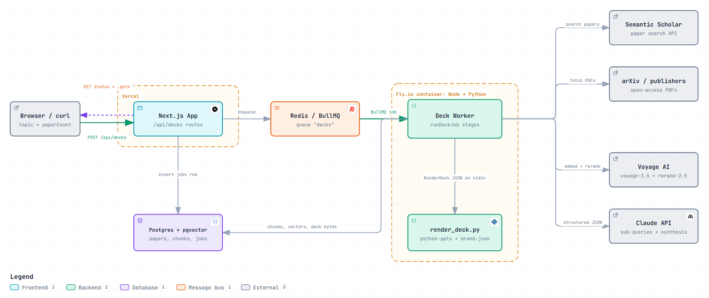
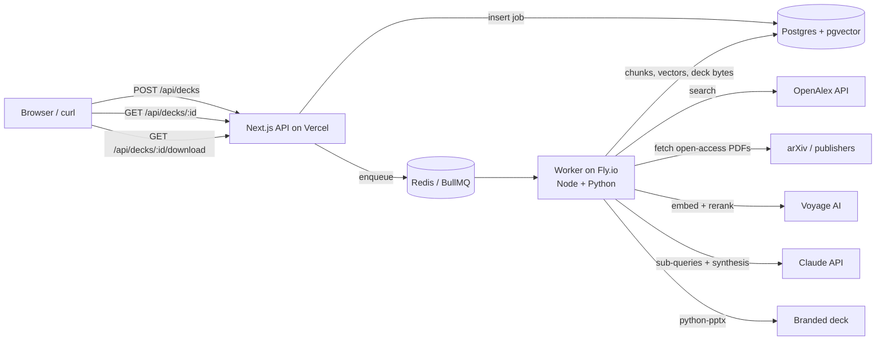

# Research-to-Deck Generator

POST a research topic → get back a branded PowerPoint deck built from 50+ papers, where every bullet cites its source paper. This is the core pipeline behind deep-research.intelliforge.tech.

**Business impact:** about 3 days of literature review becomes about 5 minutes.

## Architecture

<picture>
  <source media="(prefers-color-scheme: dark)" srcset="docs/architecture-dark.png">
  <source media="(prefers-color-scheme: light)" srcset="docs/architecture-light.png">
  
</picture>

**[Open the interactive diagram →](docs/research-to-deck-architecture.html)** — a standalone HTML file
(no build step, no network) with three guided walkthroughs: *Job submission*, *RAG pipeline*, and
*Deploy split*. Clone the repo and open it in a browser, or preview it on
[htmlpreview.github.io](https://htmlpreview.github.io/). It has light/dark themes, click-to-trace paths,
and PNG/SVG export.

<details>
<summary>Mermaid source (text fallback)</summary>



</details>

| Stage | What happens |
|---|---|
| **Searching** | OpenAlex paper search (relevance-ranked, over-fetched 2×). Papers with a PDF or abstract rank ahead of title-only ones. Results are cached for 24h per topic and provider. Set `PAPER_SOURCE=semanticscholar` to switch providers. |
| **Ingesting** | Open-access PDFs are downloaded 6 at a time (max 20 MB, 30 pages) and their text extracted with `unpdf`. The references section is dropped. Text is split into ~800-token chunks with ~100 tokens of overlap, and each chunk keeps the page it starts on. **Every paper also gets a title+abstract chunk, so papers without a PDF fall back to their abstract instead of being dropped.** Chunks are embedded with `voyage-3.5` (1024 dims) and stored in pgvector. Papers already ingested are reused across jobs. |
| **Retrieving** | Claude writes 5 sub-queries that cover different angles of the topic. For the topic plus each sub-query, the worker takes the top 15 chunks by exact cosine search over this job's papers. The pooled results are deduped and re-ranked with Voyage `rerank-2.5`, and no paper contributes more than 3 of the final 30 chunks. |
| **Synthesizing** | Claude (`claude-sonnet-5`, structured JSON output) writes 8–12 slides with 3–5 bullets each, speaker notes, and citation keys for every bullet. The worker checks every citation key against the retrieved set: unknown keys are removed and bullets left without a citation are dropped. If any rule is broken, Claude gets one repair pass with the list of problems. |
| **Rendering** | `python/render_deck.py` (python-pptx) builds a 16:9 deck from `python/brand.json`: a title slide, content slides with `[n]` citation markers, speaker notes on every slide, and numbered reference slides that list only the papers actually cited. |

The finished `.pptx` is stored in the `jobs` table and served by `GET /api/decks/:id/download`, so no separate blob store is needed.

### Why the worker is not on Vercel

Vercel functions can't host a long-running BullMQ consumer or run Python inside a Node function, and a 50-paper job runs for minutes. So the Next.js app (form + API) deploys to Vercel, and the worker deploys as a container (`Dockerfile.worker`) on Fly.io (Railway or Render work the same way). Both connect to the same Postgres and Redis.

## Local setup

Prerequisites: Node 22+, Python 3.10+ with `python-pptx`, and Docker.

```bash
npm install
pip install python-pptx==1.0.2
docker compose up -d                 # pgvector on :5433, Redis on :6380
cp .env.example .env.local           # then fill in the keys
npm run db:migrate
npm run dev                          # terminal 1: http://localhost:3000
npm run worker                       # terminal 2: BullMQ worker
```

### Environment variables

| Variable | Used by | Notes |
|---|---|---|
| `ANTHROPIC_API_KEY` | worker | Claude sub-queries + synthesis |
| `CLAUDE_MODEL` | worker | optional, default `claude-sonnet-5` |
| `VOYAGE_API_KEY` | worker | embeddings + reranking |
| `PAPER_SOURCE` | worker | optional, default `openalex`. Set to `semanticscholar` to use the old provider. |
| `OPENALEX_MAILTO` | worker | recommended. A contact address, **not** an API key: it opts you into OpenAlex's polite pool (10 req/s, 100k/day) instead of the slower anonymous pool. |
| `SEMANTIC_SCHOLAR_API_KEY` | worker | only read when `PAPER_SOURCE=semanticscholar`. That provider's keyless pool answers 429 to effectively every request, which is why it is no longer the default. |
| `DATABASE_URL` | app + worker | Postgres with the `vector` extension (Neon or Supabase in prod) |
| `REDIS_URL` | app + worker | `rediss://` for TLS (e.g. Upstash) |
| `PYTHON_BIN` | worker | interpreter with python-pptx (`python3` in the Docker image) |
| `AGENTMAIL_API_KEY` | app + worker | optional. Unset disables email delivery entirely; the rest of the pipeline is unaffected |
| `AGENTMAIL_DOMAIN` | app + worker | optional, default `agentmail.to`. A verified custom domain improves deliverability |
| `AGENTMAIL_INBOX_USERNAME` | app + worker | optional, default `decks` — the system inbox is `decks@<domain>` |
| `AGENTMAIL_WEBHOOK_SECRET` | app | `whsec_…` Svix secret; required only for inbound email |
| `APP_BASE_URL` | worker | public origin for the download/status links inside emails |

## API

```bash
# create a job
curl -X POST http://localhost:3000/api/decks \
  -H "Content-Type: application/json" \
  -d '{"topic":"retrieval-augmented generation evaluation","paperCount":50}'
# -> 202 {"jobId":"…","statusUrl":"…/api/decks/…"}

# poll status
curl http://localhost:3000/api/decks/<jobId>
# -> {"status":"running","stage":"ingesting","progress":34,"stats":{…},"downloadUrl":null}

# download when status is "done"
curl -o deck.pptx http://localhost:3000/api/decks/<jobId>/download
```

`paperCount` is 10–100 (default 50). Stages: `queued → searching → ingesting → retrieving → synthesizing → rendering → done | failed`.

Pass an optional `email` to have the finished deck mailed to you instead of polling:

```bash
curl -X POST http://localhost:3000/api/decks   -H "Content-Type: application/json"   -d '{"topic":"retrieval-augmented generation evaluation","email":"you@example.com"}'
```

## Email (AgentMail)

Email is optional. With `AGENTMAIL_API_KEY` unset, every send is skipped and the API behaves exactly as above.

**Outbound.** When a job carries a delivery address, the worker emails the `.pptx` the moment the deck is
saved, and emails a failure notice with the pipeline error if the job fails. Decks over 4 MB are not
attached (AgentMail caps a send at 6 MB including base64 overhead) — those emails carry the download link
instead. Each job sends at most one email, claimed via `jobs.notified_at` so a BullMQ retry cannot double-send.
Delivery is best-effort: an AgentMail outage never fails a deck that rendered.

**Inbound.** `POST /api/webhooks/agentmail` turns a received email into a job and replies in-thread — first
an acknowledgement, then the finished deck. The subject line is the topic (`Re:`/`Fwd:` prefixes stripped,
falling back to the first substantial body line), and a `papers: 40` line in the body sets the corpus size,
clamped to 10–100.

Register the webhook against the system inbox and copy its signing secret into `AGENTMAIL_WEBHOOK_SECRET`:

```bash
curl -X POST https://api.agentmail.to/v0/webhooks   -H "Authorization: Bearer $AGENTMAIL_API_KEY"   -H "Content-Type: application/json"   -d '{"url":"https://your-app.example.com/api/webhooks/agentmail","event_types":["message.received"]}'
```

Signatures are Svix (`svix-id` / `svix-timestamp` / `svix-signature`), verified in
[src/lib/agentmailWebhook.ts](src/lib/agentmailWebhook.ts) against the raw request body with a 5-minute
replay window. Deliveries are at-least-once, so each `event_id` is claimed in `inbound_events` before any
work happens; retries of a claimed event return `200 {"status":"duplicate"}` without queueing a second deck.

Run the whole flow end to end and save the deck to `smoke-deck.pptx`:

```bash
npm run smoke -- http://localhost:3000 "retrieval-augmented generation evaluation" 50
```

## Deploy

Live: **https://research-to-deck.vercel.app** (app on Vercel, worker on Fly.io).

1. **Database:** on the Vercel project, Storage → Create Database → Neon (free tier), connected to the project. That sets `DATABASE_URL`. Copy the value into `.env.local` and run `npm run db:migrate`.
2. **Redis:** Storage → Create Database → Upstash → **Redis** (not QStash or Vector), connected to the project. That sets `REDIS_URL`. Copy the `rediss://` value into `.env.local` too.
3. **Worker:** `fly apps create research-to-deck-worker`, then stage the secrets and deploy the container from `fly.toml` / `Dockerfile.worker`:

   ```bash
   fly secrets import --app research-to-deck-worker --stage < secrets.env   # DATABASE_URL, REDIS_URL,
                                                                           # VOYAGE_API_KEY, ANTHROPIC_API_KEY,
                                                                           # CLAUDE_MODEL, PYTHON_BIN=python3
   fly deploy --app research-to-deck-worker --remote-only --ha=false
   fly logs --app research-to-deck-worker        # expect: [worker] listening on queue "decks"
   ```

4. **App:** `vercel link` then `vercel deploy --prod`. The app only needs `DATABASE_URL` and `REDIS_URL`, both injected by the two integrations; the AI keys live on the worker alone.

Marketplace values are stored as `sensitive` on Vercel, so `vercel env pull` returns them empty. Copy the connection strings out of the Neon and Upstash store pages when you need them locally or on Fly.

## Tests

```bash
npm run typecheck && npm run lint
npm test            # chunking, citations, reference numbering, provider retry/selection, webhook signatures + email bodies
npm run test:py     # python-pptx renderer: slide count, notes on every slide, citation markers, references
```

## Project layout

```
src/app/api/decks/            POST create, GET status, GET download
src/app/page.tsx              topic form + live status
src/lib/paper.ts              provider-agnostic Paper shape + content-first selection
src/lib/paperSearch.ts        provider router (PAPER_SOURCE) + display label
src/lib/openAlex.ts           OpenAlex client (throttle, backoff, inverted-abstract rebuild)
src/lib/semanticScholar.ts    Semantic Scholar client (opt-in fallback)
src/lib/pdf.ts, chunk.ts      PDF text extraction + chunking
src/lib/ingest.ts             search cache, ingestion, pgvector upserts
src/lib/voyage.ts             embeddings + rerank
src/lib/retrieval.ts          multi-query RAG + rerank + diversity
src/lib/synthesis.ts          Claude deck synthesis + repair pass
src/lib/citations.ts          citation validation + reference numbering
src/lib/pipeline.ts           stage orchestration + timings
src/lib/email.ts              AgentMail client, system inbox, deck delivery
src/lib/emailTemplates.ts     email bodies (pure, unit tested)
src/lib/notify.ts             once-only notification claim + best-effort send
src/lib/agentmailWebhook.ts   Svix signature verification + inbound parsing
src/app/api/webhooks/         inbound AgentMail webhook
worker/index.ts               BullMQ worker
python/render_deck.py         python-pptx renderer (brand.json)
db/migrations/                schema (papers, chunks + HNSW, jobs, cache, email delivery)
```

### Paper search provider

Search runs against **OpenAlex** by default, which needs no API key. Passing a contact address
in `OPENALEX_MAILTO` puts requests in OpenAlex's *polite pool* (10 req/s, 100k/day); without it
you still get service, just from a slower shared pool.

```bash
fly secrets set OPENALEX_MAILTO=you@example.com --app research-to-deck-worker
```

Semantic Scholar was the original provider and is still selectable, but its unauthenticated
pool returns `429` on effectively every call, so a keyless job sits in backoff and fails at the
`searching` stage. Their key is behind a manual approval queue. To use it anyway:

```bash
fly secrets set PAPER_SOURCE=semanticscholar SEMANTIC_SCHOLAR_API_KEY=... --app research-to-deck-worker
```

Both providers normalise into the same `Paper` shape (`src/lib/paper.ts`), so the rest of the
pipeline is unchanged. Two OpenAlex-specific notes: abstracts arrive as an inverted index and are
rebuilt by `reconstructAbstract()`, and there is no fulltext — the PDF-or-abstract fallback in
`selectPapers()` covers works with no open-access copy. On a 50-paper run for
"retrieval augmented generation evaluation", OpenAlex returned 50/50 usable papers
(40 with a PDF, 49 with an abstract, 0 title-only) in about 5s.
